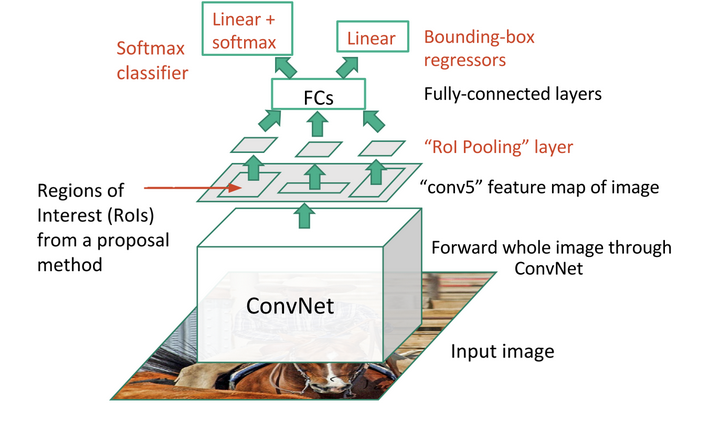
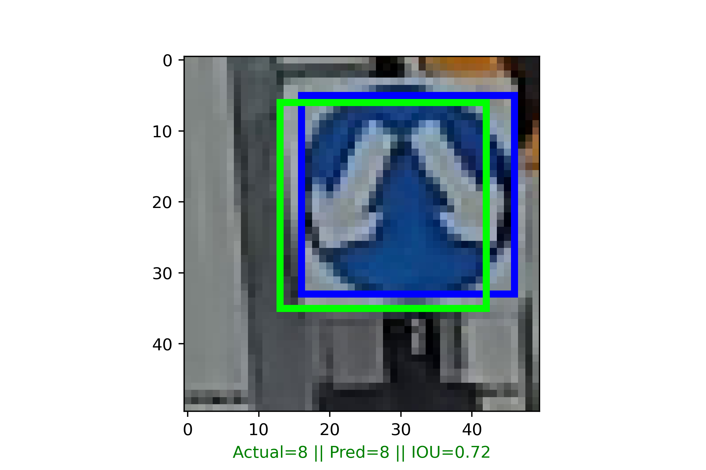

# Concepts of Advanced Driving Assistance System
#### Deep Learning in Computer Vision / CNN / Image Classification / Object Localization / Mask R-CNN / Fast R-CNN / Tensorflow Keras / GradCAM / Tensorflow Functional API / Flask API / Streamlit
---

### Lim Thien Sean

#### Industry Mentors:  
Marie Stephen Leo - https://stephen-leo.medium.com/  
Shilpa Sindhe - https://shilpa-leo.medium.com/  

---

## Executive Summary

Introduction to ADAS:

  
<i> Figure 1: Actual ADAS [18] </i>

Fatalities caused by driving a car is statistically higher than flying, with more than 5 million accidents on the road compared to flying [1].

The automotive industry have been making significant advances that have been both impactful and significant to reducing accidents. With advances in deep learning in computer vision, LiDAR sensors, ToF cameras, the industry was able to move towards implementing advanced driver assistance as a precursor to fully self driving vehicles.

Deployment of computer vision in automotive vehicles have a set of unique requirements. They are required to 'see' like humans, classify pedestrians, street signs, vehicles, road hazards and localize these objects in their field of view. A further set of sensors like LiDAR and stereo cameras add a 3rd layer of 3D depth to the vast sensing arrays deployed in automotive vehicles.

Hence, advancements in deep learning in Computer Vision (CV) plays a huge role in advancing automotive safety. There are 3 topics involved (and more that were not researched heavily in this capstone):  
    1. Object classification  
    2. Object localization  
    3. Image segmentation  

These broad topics are widely researched and requires both speed and accuracy to be able to deployed reliably. Any lack of detection at any moment even for a split second due to poor scoring or object being obscured can cause the agenda of self-driving to fail.

Traffic signs classification & localization is a topic where automotive deployed computer vision application has value owing to traffic signs containing critical information about:  
    1. Stop signs - Mandatory stop  
    2. Entrance to highway - Build up speed for merging onto highway  
    3. Pedestrian crossing - Slow down where pedestrians are expected  
    4. Speed signs - Speed limits  
    etc.  
    
  
<i> Figure 2: Example of object classification and Localization </i>

In part 1 of this project, the foundation of object classification and object localization will be explored. At the end of Part 1 of this project:  
    1. The model should be able to classify the image  
    2. The model should be able to localize the object  
    3. YOLOv4 which is a fast implementation of object classification & detection with a high frame rate will be tested on OpenCV, trajectory tracking will be used to link up object localization with object tracking.   

The dataset was obtained from 2 sources, 1 of which was from an online source with its source github listed in the source below. The 2nd source is from Google Street View. There is no intention of copyright infringement, all images are for education & research purposes with no intention for commercial deployment.

---

### Research Work before Starting the Project

Object localization was a task with different solutions. A few solutions were researched to accomplish object localization:

1. Fast R-CNN
2. R-CNN
3. Single Shot Detector (SSD)
4. YOLO (You Only Look Once)

#### R-CNN

R-CNN is significantly slower than Fast R-CNN with a higher training time as this model architecture means that the model is classifying multiple region proposals per image [2].

It takes a great amount of time to return an image localization vertices due to its architecture of:   Region proposal regeneration -> Feature extraction -> Classification.

               
<i> Figure 3: Region Proposal [3][14]</i>

Every warped region proposal has to be evaluated with ConvNet and this takes up computational power. [14]  

  
<i> Figure 4: Comparison Between Models </i>

#### Fast R-CNN

Fast R-CNN works with an architecture of region proposal network.

It uses a CNN to extract feature maps from the image and in parallel, it tries to find region proposals.

Owing to the architecture, the features map had already been completed in the first step (CNN) and region proposals can now be mapped to the features map.

Fast R-CNN has an ROI pooling layer where there will be class scores for each region proposal. convNet, when comparing to R-CNN is only run once on an image hence it is much faster than R-CNN.  

  
<i> Figure 5: Fast R-CNN architecture [3]</i>

Hence, Fast R-CNN network will be evaluated in this project and built from ground up.  

---

### Dataset Preparation

There are no labels in the images in the dataset and the images have to be prepared by manually labeling.

LabelImg is a great software authored by: tzutalin [15] and it helps with labeling the image quickly by allowing user to draw bounding boxes and write bounding box vertices to an XML file in PascalVOC format so it can be parsed afterwards.

  
<i> Figure 6: LabelImg [3]</i>

It gives class, coordinates and file path upon saving.

  
<i> Figure 7: LabelImg Bounding Box vertices on XML [3]</i>

### Modelling

Keras, a high level API to Tensorflow, was used to build Convolutional Neural Networks (CNNs) and trained on the traffic signs dataset. The classification problem was explored with a sequential model, followed by a functional model to achieve vertices output for object localization.

For the sequential model, the output expected was the class of the image which is identified through dictionary defined at the start of the codebook. The problem was defined to be a multi-class classification of 32 classes.

For the functional model, the images contained higher number of inputs, containing the image array and array containing 4 vertices of the boundary box labelled by human labeller (author of this project). The base layer were shared by both the classification branch and the localizer branch.

In both of the models, it is assumed that both images contained only one traffic sign.

Going back to the fundamentals, both models will have the base layers built with custom layers.

---
#### Sequential Model

In the Sequential model, there will be 2 Conv2D before a MaxPool2D layer to extract features.
A BatchNormalization layer was added to reduce overfitting and used to prevent exploding gradient issue - which means that large error gradients build up due to multiplications of large derivatives, causing large updates to neural network model weights. This causes the model to fail to learn. [9][10]

Dropout was added to prevent the model from becoming weight dependent by randomly dropping weights in layers. [9]

The activation function used for classification was 'Softmax' which will assign class probabilities to each class. [11]

  
<i> Figure 8: Sequential Model </i>

---
#### Functional Model

The goal of the functional model is to build upon the model's capability to classify and return one more set of arrays, the 4 vertices predicting the bounding box containing the object.

Transitioning from Sequential to Functional model, the image array, class and the object bounding box vertices were added.

There were now 2 branches: cl_head and bb_head

'cl_head' contains classification labels.  
'bb_head' contains bounding box 4 vertices.  

The activation functions were different for classification branch and the localizer branch.

'Softmax' remained in use for classification as it predicts class probablities for each class.
'Sigmoid' was used for bounding box regression.

  
Figure 9: Functional Model with Fast R-CNN architecture    

  
Figure 9-1: Visualizing Functional API model connections & output shape  

---
#### GradCAM

Gradient-weighted Class Activation Mapping (Grad-CAM) emphasizes image using the gradient of an image used for classification that flows into the final convolution layer. It produces a coarse localization heatmap that highlights the crucial regions that are being used to predict the classification. [12]

Using the gradients or the model loss, we can tell how the characteristics of the image are emphasized through the creation of heatmaps. [13]

In this project, the concept of Grad-CAM was applied to certain classification images.

From the images as follows: We can see how certain features are localized and emphasized.

---
In this example and in similar images, the model recognizes the 2 arrows.

           
<i> Figure 10: GradCAM 1 </i>

In this example and in similar images, the model recognizes the line across the image.

           
<i> Figure 11: GradCAM 2 </i>

In this example and in similar images, the model managed to localize and recognize the circle and its features.

           
<i> Figure 12: GradCAM 3 </i>

In this example and in similar images, the model recognizes and emphasizes the half split characteristics of this sign.

           
<i> Figure 13: GradCAM 4 </i>

### Metric

There are 2 sets of metrics for classification and localization.

For classification, 2 useful metrics will be precision and AUC-ROC score.
These 2 metrics will substantiate the classification by telling us the precision from classification and the separability of the classification.

Intersection over Union (IoU) or 'Jaccard Distance' is a good measure of the accuracy of the regression. [b]

                 
<i> Figure 14: IOU metric [b] </i>

#### Results of Classification

Classification results had an average precision score of <b>0.97</b>.

  
<i> Figure 15: Results of Classification [b] </i>

#### Results of object localization

Average results of IOU is <b>0.88</b>.

Below are samples of the images that were both classified and localized.

  
<i> Figure 16: Image localization IOU results </i>

  
<i> Figure 17: Image localization IOU results </i>

  
<i> Figure 18: Image localization IOU results </i>

  
<i> Figure 19: Image localization IOU results </i>

  
<i> Figure 20: Image localization IOU results </i>

  
<i> Figure 21: Image localization IOU results </i>

### Flask API

To enable fast rendering, the API would only return class and boundary box vertices.

The rendering of the bounding boxes would be performed on the local machine.

The file to serve the API was saved as 'serve.py' inside the working folder.

  
<i> Figure 22: API structure </i>

### Simple web deployment

The model was deployed as a simple web app in Streamlit.

  
<i> Figure 23: Simple web app using Streamlit to demonstrate model deployment </i>

## Object Tracking

With the knowledge that YOLO has the fastest detection and the highest frame rate, yoloV4 weights was used for object tracking in video.
Using YOLOv4 weights, the weights were input onto OpenCV with DNN module to attempt to get the highest frame rate so that object trajectory can be coded.

Using YOLOv4 object detection, the coordinates of the center of each bounding box can be tracked. Each object detected was given an object ID.

By tracking the location of one frame to the next frame, the trajectory of the object can be tracked so each object in the frame has its own unique ID.

A threshold of 30 pixels were set so that if the object detection from the previous to the next frame exceed 30 pixels, the object would be popped.

Below are a sample of the results:

  
<i> Figure 24: Trajectory tracking using yoloV4 with OpenCV </i>

This is a work in progress and might work better using image segmentation techniques. [17]

  
<i> Figure 25: Trimmed video with carplates censored. [18] </i>

---

## Part 1 - Conclusion

In conclusion, from this project, it can be seen that the objectives intended were achieved.
The model was built without using transfer learning from pretrained models. And this solidified the foundation of understanding architectures similar to Fast R-CNN models.

This may not be the best method, but it is highly adaptable and can be tuned to different sets of images by using libraries like Grad-CAM to understand what each convolution layer sees eg. Lines, Contours, Edges.

In part 2 of this project, this project will research on:
1. Architectures like Single Shot Detectors, and it will solidify the aim of speed and accuracy.
2. Mask R-CNN, to compare results between simple convolutional network vs deep residual neural networks like ResNet101.

#### Room for improvements

It might be a good idea to replace the base layer with a pretrained model like mobilenetV3 / EfficientNet / ResNet / VGG16.

By making use of a pretrained model, it could improve results and reduce overfitting.

The image dataset could also be more zoomed out so that the model is able to see higher variations of the image compared to zoomed in images.

---

# Part 2 - Mask R-CNN for Traffic Objects

## Mask R-CNN

Mask R-CNN is planned for implementation in this project. The Mask R-CNN architecture used was cloned from Matterport's Github.
https://github.com/matterport/Mask_RCNN

Mask R-CNN is a state-of-the-art model used for image segmentation, followed closely by new techniques on researches using transformers with Computer Vision, eg. Mask-Former.

The architecture of Mask R-CNN builds upon Faster-RCNN, hence follows a region based convolutional network that returns bounding box and its class label with confidence score. Mask R-CNN will be used to classify, localize and mask the traffic objects in this project.

The Mask R-CNN to be used for this project has a backbone using ResNet101 [h] that uses a residual network that network architect use to allow deep neural networks without facing gradient instability or exploding/vanishing gradients.

Deeper neural networks using residual networks with a higher depth was proven to demonstrate higher accuracy in the paper "Deep Residual Learning for Image Recognition". [h]
A possible improvement to this project can be replacing the backbone from ResNet101 to ResNet152 that is substantially deeper.

  
<i> Figure 26: Mask R-CNN architecture [g] </i>

Matterport's Mask-RCNN has some differences from the official paper, it resizes but keeps the original image aspect ratio by padding the image. [19]

Mask R-CNN has a region proposal network that simultaneously predicts object bounds and objectness scores at different positions of the image. It also includes a Non-Maximum Suppression (NMS) post processing step for collapsing the ROI's into the smallest box that encapsulates the pixels of the object, using confidence intervals that are above threshold setup during initial configuration stage. [19]

### Data and Model Preparation

In this project, the setup is as follows:  
DETECTION_MIN_CONFIDENCE       0.9  
DETECTION_NMS_THRESHOLD        0.3  

The masks over the objects were annotated manually using "makesense.ai" [20] using polygons saved in JSON format.

  
<i> Figure 27: "Cars" Class Mask Annotation </i>

---

Mask R-CNN annotations and development ongoing..

## Ongoing Project

Next step in the research and development work will be to improve this model and to use Mask R-CNN to include image segmentation.

Task 1: Mask R-CNN by expanding on the current Functional API model architecture.  
Task 2: Single Shot Detectors  
Task 3: YOLO on custom dataset  
Task 4: Stereo Camera CV

## Sources: 

[1] https://traveltips.usatoday.com/air-travel-safer-car-travel-1581.html#:~:text=In%20absolute%20numbers%2C%20driving%20is,air%20travel%20to%20be%20safer.

[2] https://towardsdatascience.com/r-cnn-fast-r-cnn-faster-r-cnn-yolo-object-detection-algorithms-36d53571365e

[3] https://towardsdatascience.com/region-of-interest-pooling-f7c637f409af

[4] https://towardsdatascience.com/with-keras-functional-api-your-imagination-is-the-limit-4f4fae58d90b

[5] https://towardsdatascience.com/review-mobilenetv2-light-weight-model-image-classification-8febb490e61c

[6] https://medium.com/analytics-vidhya/train-a-custom-yolov4-object-detector-using-google-colab-61a659d4868

[7] https://traveltips.usatoday.com/air-travel-safer-car-travel-1581.html

[8] https://medium.com/analytics-vidhya/iou-intersection-over-union-705a39e7acef

[9] https://medium.datadriveninvestor.com/2-layers-to-greatly-improve-keras-cnn-1d4d1c3e8ea5

[10] https://towardsdatascience.com/the-vanishing-exploding-gradient-problem-in-deep-neural-networks-191358470c11?gi=27e999e4010f

[11] https://developers.google.com/machine-learning/crash-course/multi-class-neural-networks/softmax

[12] https://towardsdatascience.com/understand-your-algorithm-with-grad-cam-d3b62fce353#:~:text=Gradient%2Dweighted%20Class%20Activation%20Mapping,regions%20in%20the%20image%20for

[13] https://arxiv.org/pdf/1610.02391.pdf

[14] https://towardsdatascience.com/fast-r-cnn-for-object-detection-a-technical-summary-a0ff94faa022

[15] https://github.com/tzutalin/labelImg

[16] https://towardsdatascience.com/what-is-the-difference-between-object-detection-and-image-segmentation-ee746a935cc1

[17] https://www.researchgate.net/figure/Object-tracking-based-on-image-segmentation-and-similar-object-feature-matching_fig1_4222458

[18] https://m.futurecar.com/4632/Computer-Vision-Developer-StradVision-to-Showcase-its-Most-Advanced-Perception-Camera-for-Autonomous-Driving-&amp;-ADAS-at-Auto-Tech-2021

[19] https://github.com/matterport/Mask_RCNN

[20] https://www.makesense.ai/

---

[a] Research papers and materials: With great thanks to the following authors for sharing their research papers and materials on the topic of object classification and localization.

[b] Object Detection and Localization with Deep Networks, Avi Kak and Charles Bouman, Purdue University

[c] Universal Bounding Box Regression and Its Applications, Seungkwan Lee, Suha Kwak and Minsu Cho, Dept. of Computer Science and Engineering, POSTECH Korea

[d] Intelligent Vision Systems & Embedded Deep Learning Technology for ADAS, Jiun-In Guo, National Yang Ming Chiao Tung University

[e] Grad-CAM: Visual Explanations from Deep Networks via Gradient-based Localization, Ramprasaath R. Selvaraju · Michael Cogswell · Abhishek Das · Ramakrishna
Vedantam · Devi Parikh · Dhruv Batra

[f] Stereo RCNN based 3D Object Detection for Autonomous Driving, https://github.com/srinu6/Stereo-3D-Object-Detection-for-Autonomous-Driving

[g] An automatic nuclei segmentation method based on deep convolutional neural networks for histopathology images - Scientific Figure on ResearchGate. Available from: https://www.researchgate.net/figure/The-overall-network-architecture-of-Mask-R-CNN_fig1_336615317 [accessed 13 Apr, 2022]

[h] Deep Residual Learning for Image Recognition, Authors: Kaiming He, Xiangyu Zhang, Shaoqing Ren, Jian Sun

---

Dataset: 
There is no intention of copyright infringement, all images are for education & research purposes with no intention for commercial deployment.

1. https://github.com/eugeneyan84
2. Google Street View
3. Taken with mobile phone

---

Saved Models and Weights:

https://drive.google.com/file/d/1kokwbQd20Y_jmHTJo3x8ysc2_NUyn-ur/view?usp=sharing

Images Datasets:

https://drive.google.com/drive/folders/1upxY-xXbUB1Yd1afpCJG--8tgndd_2DN?usp=sharing

